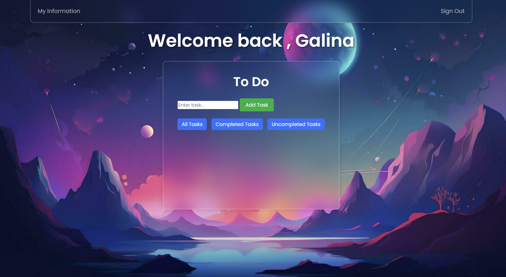

# Task Management System

## Table of Contents:
1. [Introduction](#introduction)
2. [Features](#features)
3. [Key Functionalities](#key-functionalities)
4. [Requirements](#requirements)
5. [Installation](#installation)
6. [Usage](#usage)
7. [How to Use](#how-to-use)
8. [Code Structure](#code-structure)
9. [Authors](#authors)
10. [Screenshots](#screenshots)
11. [Commit History](#commit-history)

## Introduction
The Task Management System is a comprehensive web application built with Spring Boot, a relational database, and front-end markup. It provides a platform for efficient task management within an organization, featuring different account types such as worker, manager, and director.

## Features
- User account management (worker, manager, director)
- Task creation, assignment, and tracking
- Role-based access control
- Database integration for persistent data storage
- Responsive front-end design

## Key Functionalities
1. **User Authentication:**
   - Implement a secure authentication system to allow users (workers, managers, and directors) to log in with their credentials.

2. **Task Creation:**
   - Enable users, particularly managers and directors, to create tasks by providing detailed descriptions and specifying relevant details such as due dates.

3. **Task Assignment:**
   - Implement the functionality to assign tasks to specific workers, allowing managers and directors to distribute workload efficiently.

4. **Role-Based Access Control:**
   - Set up role-based access control to ensure that each user has access only to features and data relevant to their role (worker, manager, or director).

5. **Task Tracking:**
   - Provide a mechanism for tracking the status and progress of tasks, allowing workers, managers, and directors to monitor ongoing activities.

6. **Database Integration:**
   - Integrate a relational database (e.g., MySQL, PostgreSQL) to persistently store user account information, task details, and other relevant data.

7. **Responsive Front-End Design:**
   - Implement a responsive and user-friendly front-end design to ensure a seamless user experience across different devices and screen sizes.

8. **Documentation:**
   - Create comprehensive documentation for developers, including setup instructions, API documentation, and any other relevant information needed for future maintenance.

9. **Logging and Auditing:**
   - Implement logging mechanisms to record user actions and changes in the system. This is essential for tracking system behavior and troubleshooting.

10. **Error Handling:**
   - Develop robust error-handling mechanisms to gracefully manage unexpected scenarios, providing meaningful error messages to users and logging errors for system administrators.

## Requirements
- Java Development Kit (JDK) 8 or higher
- Spring Boot framework
- Relational database (e.g., MySQL, PostgreSQL)
- Front-end markup (HTML, CSS, JavaScript)

## Installation
1. Clone the repository: `https://github.com/kimgalina/Task_Management_System.git`
2. Navigate to the project directory: `cd task-management-system`
3. Configure the database settings in `application.properties`.
4. Build and run the application: `./mvnw spring-boot:run`

## Usage
- Access the application through a web browser.
- Log in with your account credentials.
- Explore the dashboard, create tasks, and manage your workload.

## How to Use
1. **Account Types:**
   - Worker: Manages and completes assigned tasks.
   - Manager: Creates tasks, assigns them to workers, and monitors progress.
   - Director: Has access to overall task and account management.

2. **Task Management:**
   - Create tasks with detailed descriptions.
   - Assign tasks to specific workers or leave unassigned for managers to distribute.
   - Track task status and completion.

3. **Role-Based Access:**
   - Workers can view and manage their tasks.
   - Managers can create tasks, assign them, and monitor progress.
   - Directors have access to all aspects of task and account management.

## Code Structure
The project follows a modular structure to enhance maintainability and readability. Key classes include:
- **Application:** Main class for initializing and running the Spring Boot application.
- **Controller:** Manages HTTP requests, handles user input, and interacts with services.
- **Service:** Contains business logic, interacts with the database, and handles task-related operations.
- **Repository:** Manages data access and database interactions.

## Authors
1. [Galina Kim](https://t.me/genriettakim) - Backend development lead.
2. [Kylychbek Parpiev](https://t.me/vkusnoochennn) - Front-end development lead.
3. [Isa Kasymbek uulu](https://t.me/jes_sues) - Database management lead.

## Team Members
1. **Kylychbek Parpiev**
   - **Role:** Frontend Developer
   - **Responsibilities:**
      - Design and implement user interface components.
      - Ensure responsiveness and cross-browser compatibility.
   - **GitHub Username:** @kkylych

2. **Galina Kim**
   - **Role:** Backend Developer
   - **Responsibilities:**
      - Implement server-side logic.
   - **GitHub Username:** @kimgalina

3. **Isa Kasymbek uulu**
   - **Role:** Backend Developer
   - **Responsibilities:**
      - Integrate with databases .
   - **GitHub Username:** @member3

## Screenshots

## Commit History

- Maintain a detailed commit history, starting from more than 1 week before the submission date.
- | Commit ID | Author | Date       | Message                                        |
- | 9cfc901 | @kimgalina | Sat Dec 16 23:09:55 2023 +0600 | Merge branch 'dev' of https://github.com/kimgalina/Task_Management_System into dev |
- | da91419 | @kimgalina | Sat Dec 16 23:09:30 2023 +0600 | added documentation |
- | 6d5d734 | @kkylch | Sat Dec 16 23:06:12 2023 +0600 | create english documentation |
- | 766f1d0 | @kkylch | Sat Dec 16 22:46:50 2023 +0600 | Merge branch 'dev' of https://github.com/kimgalina/Task_Management_System into dev |
- | 1c74758 | @kkylch | Sat Dec 16 22:42:01 2023 +0600 | frontend documentation |
- | 763d75a | @IsaKasymbekuulu | Sat Dec 16 22:41:46 2023 +0600 | some changes |
- | a2c2b2c | @IsaKasymbekuulu | Sat Dec 16 22:26:38 2023 +0600 | Add documentation |
- | 0617cf1 | @IsaKasymbekuulu | Sat Dec 16 22:12:59 2023 +0600 | Add documetaion |
- | 7a87a29 | @kimgalina | Sat Dec 16 20:14:14 2023 +0600 | changes |
- | 5e19d83 | @kimgalina | Sat Dec 16 18:03:20 2023 +0600 | the second verion of the working product |
- | 85a2528 | @kimgalina | Sat Dec 16 16:30:46 2023 +0600 | added filtering of my tasks |
- | c4bca6c | @kimgalina | Sat Dec 16 14:45:54 2023 +0600 | added functions in js for opening modal window 'my information |
- | 07f3cea | @IsaKasymbekuulu | Fri Dec 15 22:07:19 2023 +0600 | add data base |
- | 4681729 | @kimgalina | Wed Dec 13 00:20:06 2023 +0600 | added DELETE request handlers |
- | 5c7c3f0 | @kimgalina | Tue Dec 12 23:26:06 2023 +0600 | added patch request handlers |
- | 1291f1d | @kimgalina | Tue Dec 12 21:55:34 2023 +0600 | first working version of the project |
- | 5203409 | @kimgalina | Tue Dec 12 14:26:02 2023 +0600 | Merge branch 'dev' of https://github.com/kimgalina/Task_Management_System into dev |
- | 431e7d9 | @kimgalina | Tue Dec 12 14:22:34 2023 +0600 | fixed bug on front part |
- | cff9694 | @IsaKasymbekuulu | Tue Dec 12 13:59:15 2023 +0600 | delete unusable files |
- | 6aef50f | @IsaKasymbekuulu | Tue Dec 12 13:53:16 2023 +0600 | delete unusable files |
- | 9f2338f | @IsaKasymbekuulu | Tue Dec 12 13:50:22 2023 +0600 | Удалена папка target |
- | a8dd993 | @kimgalina | Tue Dec 12 00:16:05 2023 +0600 | modify assignment to users |
- | 9d48d16 | @kimgalina | Mon Dec 11 23:31:19 2023 +0600 | fixed bugs |
- | eb34c33 | @kkylch | Mon Dec 11 21:37:19 2023 +0600 | Merge branch 'dev' of https://github.com/kimgalina/Task_Management_System into dev |
- | 6e50f4e | @kkylch | Mon Dec 11 20:57:01 2023 +0600 | Create user todo page |
- | f9ec6a7 | @kimgalina | Mon Dec 11 18:03:54 2023 +0600 | now director and manager can assign tasks to others |
- | cb3ff86 | @kkylch | Mon Dec 11 18:02:53 2023 +0600 | Create options to change info and fix bugs |
- | 1971127 | @kimgalina | Mon Dec 11 14:53:13 2023 +0600 | added new class Task , added function in js for send post request to server , added post method handler |
- | 4478f5b | @kimgalina | Mon Dec 11 11:50:59 2023 +0600 | some changes |
- | b3be4a7 | @kimgalina | Mon Dec 11 11:12:59 2023 +0600 | added dinamic list of managers and workers |
- | e47faf4 | @kimgalina | Mon Dec 11 01:55:38 2023 +0600 | fixed bug |
- | af8575c | @kimgalina | Mon Dec 11 01:32:25 2023 +0600 | added method for processing sign in , sign up , registration |
- | c0573e4 | @kimgalina | Mon Dec 11 00:38:53 2023 +0600 | added chooser for status on front side and UserController RegistrationController LoginController |
- | e1e1375 | @kimgalina | Sun Dec 10 20:40:32 2023 +0600 | changed front files location |
- | e1231cb | @kkylch | Sun Dec 10 01:21:52 2023 +0600 | Create director page |
- | 5fd0b5d | @kkylch | Sun Dec 10 00:44:31 2023 +0600 | Create worker and manager pages |
- | 251a008 | @kkylch | Wed Dec 6 18:03:40 2023 +0600 | Create registration and todo list |
- | 50beee8 | @kimgalina | Wed Dec 6 11:27:09 2023 +0600 | added sign_in file |
- | afb997f | @kimgalina | Wed Dec 6 11:06:59 2023 +0600 | methods for registration and success registration and redirecting do user profile |
- | 33ec434 | @kimgalina | Tue Dec 5 12:28:32 2023 +0600 | changes |
- | d982daf | @kimgalina | Mon Dec 4 16:03:04 2023 +0600 | template for application |
- | 1ffb5f7 | @kimgalina | Mon Dec 4 15:46:46 2023 +0600 | Initial commit |

## Commit History

### Dec 16, 2023
- Merged changes from 'dev' branch into main.
- Added English documentation.
- Made some changes and added frontend documentation.
- Added documentation and made some changes.

### Dec 15, 2023
- Added database functionality.

### Dec 13, 2023
- Added DELETE request handlers.

### Dec 12, 2023
- Added PATCH request handlers.
- Released the first working version of the project.
- Fixed a bug on the front-end.
- Deleted unusable files.

### Dec 11, 2023
- Fixed bugs.
- Created a user todo page.
- Enabled directors and managers to assign tasks to others.
- Created options to change information and fixed bugs.
- Added a new class Task, implemented a function in JS for sending post requests to the server, and added a post method handler.
- Added dynamic lists of managers and workers.
- Fixed a bug.
- Added a method for processing sign-in, sign-up, and registration.
- Added a chooser for status on the front-end, UserController, RegistrationController, and LoginController.

### Dec 10, 2023
- Changed the location of front-end files.
- Created a director page.

## GitHub Link
[Task Management System GitHub Repository](https://github.com/kimgalina/Task_Management_System)

## Presentation Link
https://drive.google.com/drive/folders/1Ee84hyvz6FcIW_DnBA3s_8HbLAxhB11D?usp=sharing
